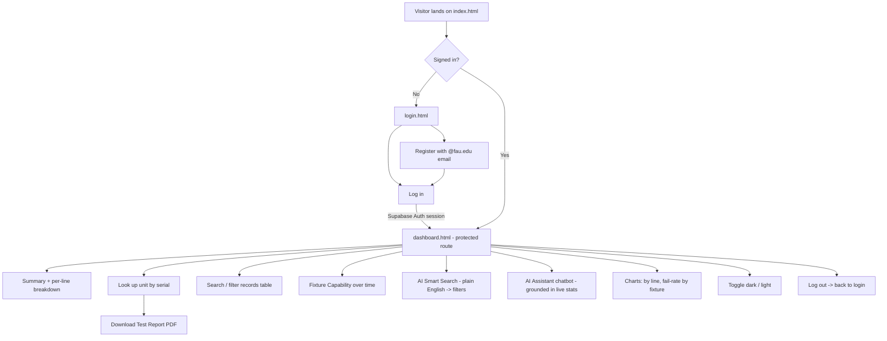
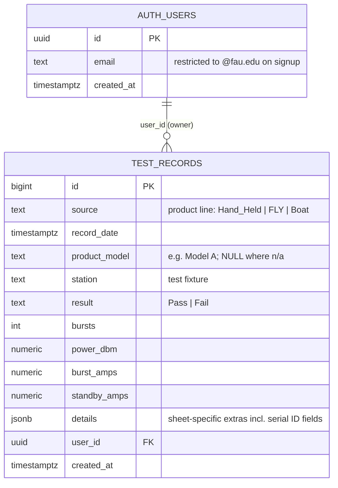
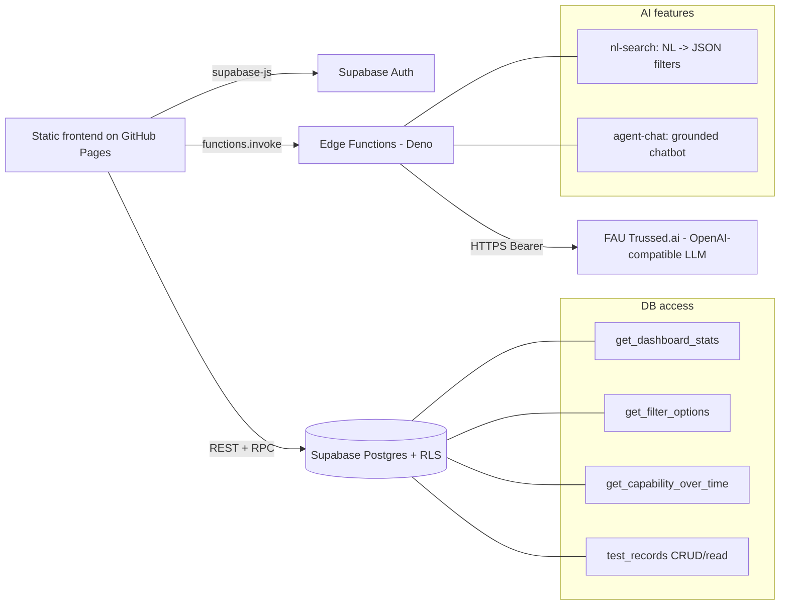

# Design & Planning — Product Tracker

Author: Joshua Lopez · Z23384309 · Joshualopez2016@fau.edu

This document covers the user flow, database schema, API architecture, and
feature-planning notes for the Week 3 project. Endpoint request/response detail
and test cases live in [API_ENDPOINTS.md](API_ENDPOINTS.md); cost analysis in
[COST_ANALYSIS.md](COST_ANALYSIS.md).

---

## 1. User flow

**Protected route:** `dashboard.html` calls `requireLogin()` on load; no Supabase
session → redirect to `login.html`. Row Level Security also blocks data reads for
unauthenticated requests, so protection is enforced both client- and server-side.

---

## 2. Database schema

Single source-of-truth table plus Supabase-managed auth. The three source Excel
sheets (`Hand_Held`, `FLY`, `Boat`) had different shapes, merged into one table;
sheet-specific extras live in a JSON `details` column.

- **Serial number** = a 3-digit ID prefix + a 5-digit ID suffix, stored in
  `details` under per-line keys (`Boat`: id1/id2, `Hand_Held`: start_n/end_n,
  `FLY`: id_1/id_n) and rendered as `prefix-suffix` (e.g. `270-10741`).
- **RLS:** authenticated users can read; a `BEFORE INSERT` trigger on `auth.users`
  restricts registration to approved email domains (`fau.edu`).
- **Indexes / functions:** see [../sql/schema.sql](../sql/schema.sql).

---

## 3. API architecture

- **Secrets:** the LLM key (`TRUSSED_API_KEY`) is a **server-side Edge Function
  secret** — never in the browser. The Supabase publishable key and the free
  AISStream key are safe client-side (gated by RLS / free & rate-limited).
- **Resilience:** read RPCs retry with backoff on cold-start timeouts; AI calls
  have loading states and map provider errors (401/403/404/429) to friendly text.
- Full request/response shapes and test cases: [API_ENDPOINTS.md](API_ENDPOINTS.md).

---

## 4. Feature planning notes

| Feature | Problem it solves | How |
|---|---|---|
| Serial lookup + Test Report PDF | Trace one unit's full history & produce a report | `details` ID fields → query → jsPDF report with graphs |
| AI Smart Search | Query without knowing filters/SQL | LLM turns plain English into structured filters |
| AI Assistant | Answer data questions in context | LLM given live on-screen stats as grounding |
| Fixture Capability over time | Know *when* a fixture degrades | Group fails by hour/week/month → flag worst window for maintenance |
| Charts + breakdown | See pass/fail patterns at a glance | Chart.js over aggregated RPC output |

**Tech stack:** HTML / CSS / vanilla JS · Supabase (Postgres, Auth, Edge
Functions/Deno) · Chart.js · Leaflet + AISStream · jsPDF · FAU Trussed.ai
(`cogito:14b`). Hosted on GitHub Pages.
